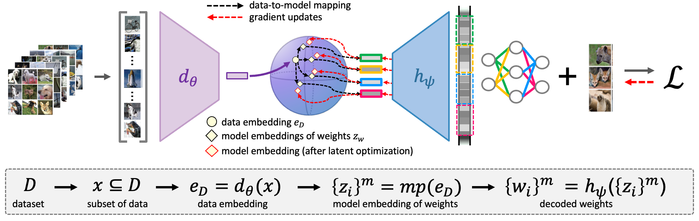
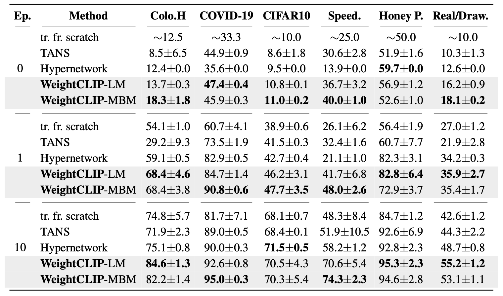

<a name="readme-top"></a>

# WeightCLIP: Aligning Datasets and Models for Weight Space Learning

<p align="center">
    <a href="https://arxiv.org/abs/2607.03551"></a>
    <a href="https://huggingface.co/aasefaw/WeightCLIP"></a>
    <a href="https://icml.cc/media/PosterPDFs/ICML%202026/61346.png?t=1783035782.4478498"></a>
    <a href="https://icml.cc/media/icml-2026/Slides/61346.pdf"></a>
</p>


<p align="center">
This is the official implementation of <b>WeightCLIP: Aligning Datasets and Models for Weight Space Learning</b> (ICML 2026).
</p>

<div align="center">
Aron Asefaw, Konstantinos Tzevelekakis, Damian Falk, Léo Meynent, Damian Borth
</div>


## Overview

We propose **WeightCLIP**, a method for learning a **dataset-aligned** latent space for neural networks. A weight-space autoencoder encodes models into latent representations while a dataset encoder encodes samples of the datasets they were trained on, and the two are aligned with a **contrastive objective** that reshapes the weight space using the datasets as a semantic reference frame. Once trained, a *data prompt* from an unseen dataset can be mapped into the aligned space and decoded into model weights tailored to that dataset, and a **latent refinement** step can further improve generated models beyond standard fine-tuning. Explicitly incorporating dataset information strengthens dataset–model **retrieval**, out-of-distribution model **generation**, and **refinement**.

<p align="center">
  
</p>


## Installation

Requires Python >= 3.10 (tested with 3.10.12) and, for training, a CUDA-capable GPU.

```bash
conda create -n weightclip python=3.10 -y
conda activate weightclip

pip install -r requirements.txt
pip install -e .
```

## Training

Training proceeds in two steps: build the model zoos, then train the aligned latent space.

### Build the model zoos

Skip this if you already have zoos. Source and output paths are set via environment variables at the
top of each script (e.g. `SOURCE_ZOO_ROOT`, `ZOO_ROOT`).

```bash
bash scripts/train_resnet18slim_metatrain_zoos.sh   # ResNet18 zoos
bash scripts/train_cnn3_metatrain_zoos.sh           # CNN zoos
```

### Train WeightCLIP

Training is configured with [Hydra](https://hydra.cc/); `run.py` selects an experiment with
`--config-name` and accepts overrides for any field. The zoos used by each experiment are listed in
`config/data/meta_train_resnet.yaml` and `config/data/meta_train_cnn.yaml`. A run writes a
`checkpoint.pt` and a sibling `dataset_encoder.pt` under `root_dir/experiment_name`.

```bash
python run.py --config-name contrastive_multi_zoo_resnet_alignment   # ResNet18
python run.py --config-name contrastive_multi_zoo_cnn_alignment      # CNN

# overrides and single-process (debug) execution
python run.py --config-name contrastive_multi_zoo_resnet_alignment \
  root_dir=/path/to/experiments experiment_name=weightclip_resnet \
  alignment.objective=siglip alignment.weight=0.5 dataset_encoder.set_size=10
python run.py --config-name contrastive_multi_zoo_resnet_alignment --debug
```

## Inference

Given a trained weight-space autoencoder and a dataset encoder, use a dataset prompt to generate models and optionally refine them.

Pretrained ResNet18 and CNN checkpoints are available on the [Hugging Face model repo](https://huggingface.co/aasefaw/WeightCLIP/tree/main). Each includes a `checkpoint.pt` and its sibling `dataset_encoder.pt`; point `--sane-ckpt` at the downloaded `checkpoint.pt` (or its directory) to run the commands below without training from scratch.

### Dataset-to-model generation

Map an out-of-distribution dataset prompt to model weights and evaluate after 0, 1, and 10 epochs of
fine-tuning. `--mode` selects the mapper: `direct_decode` (linear mapper, LM), `memory_bank`
(memory-bank mapper, MBM), `neighbour` (retrieval), or `scratch` (from-scratch baseline).

```bash
python scripts/dataset_to_model.py \
  --sane-ckpt /path/to/experiment/checkpoint_000000 \
  --arch cnn3 --mode memory_bank
```

Out-of-distribution dataset-to-model generation on ResNet18 (test accuracy %, after 0/1/10 epochs of
fine-tuning):

<p align="center">
  
</p>


### Latent refinement

Refine a generated model's latent with gradients through the decoder, which outperforms standard fine-tuning under the same compute budget:

```bash
python scripts/latent_refine_with_translator.py \
  --sane-ckpt /path/to/experiment/checkpoint_000000.pt \
  --arch cnn3 --steps 20 --scale-to-shell
```


## Citation

```bibtex
@inproceedings{asefaw2026weightclip,
  title     = {WeightCLIP: Aligning Datasets and Models for Weight Space Learning},
  author    = {Asefaw, Aron and Tzevelekakis, Konstantinos and Falk, Damian and Meynent, L\'eo and Borth, Damian},
  booktitle = {Proceedings of the Forty-third International Conference on Machine Learning (ICML)},
  year      = {2026}
}
```