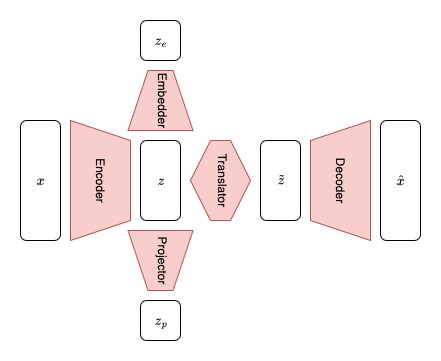

# SANE AutoEncoder

## Model description

This sub-module implements the SANE AutoEncoder and its corresponding components. The different components' nomenclature is described in the following.

* The `Encoder` takes as input the tokens $x$, of dimension ($B$, $N$, $T$), and outputs the latent representation --- also named *hyper-representation* --- $z$ of dimension ($B$, $N$, $L$).
* The `Translator` eventually transforms $z$ into an alternative $\tilde{z}$ of dimension ($B$, $\tilde{N}$, $\tilde{L}$) that can be fed to the decoder, e.g. in cases where the Encoder and the Decoder are not meant to be symmetric. This is not used in the original SANE, where the `Translator` is simply the identity function and $N = \tilde{N}$, $L = \tilde{L}$. The `Translator` can be set to `None` to deactivate it (in which case it will represent the identity function).
* The `Decoder` takes as input the tokens $x$, of dimension ($B$, $\tilde{N}$, $\tilde{L}$), and outputs a reconstruction $\hat{x}$ of dimension ($B$, $\hat{N}$, $\hat{T}$). In the original SANE, we reconstruct the original model and therefore have $N = \hat{N}$ and $T = \hat{T}$.
* The `Projector` takes as input $z$ and projects it into a 1D tensor $z_p$ of dimension $P$. $z_p$ is typically used for the contrastive loss computation. It can be set to `None` to deactivate it.
* The `Embedder` takes as input $z$ and projects it into a 1D tensor $z_e$ of dimension $E$. In the original SANE, the `Embedder` computes the average over tokens and we have $E = T$. $z_e$ is a fixed-size, per-model embedding.

### Methods

The SANEAutoEncoder class implements the following methods:
* `forward` computes all outputs from $x$, except for $z_e$. It outputs the tensors $\hat{x}$ and $z$, eventually $z_p$ if a `Projector` is defined, eventually $\tilde{z}$ if `Translator` is defined.
* `forward_embeddings` computes $z_e$ from $x$.

### Tensor dimensions glossary

* $B$ is the batch size
* $N$ is the number of tokens
* $T$ is the token size
* $L$ is the latent dimension

## Files organization

* `autoencoder.py` implements the core class `SANEAutoEncoder` described above.
* `transformer.py` implements the transformer-based encoders and decoders used in the original SANE.
* `projection.py` implements simple projections that can be used for the `Projector` and the `Embedder`.
